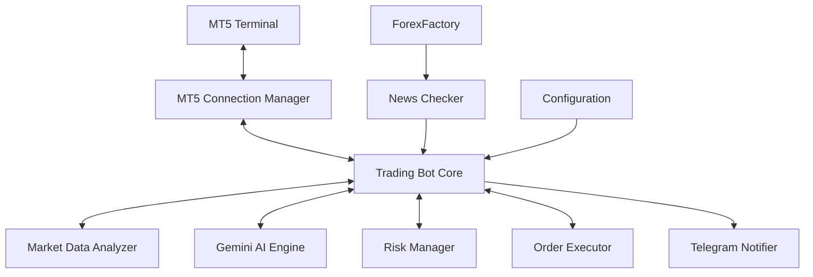
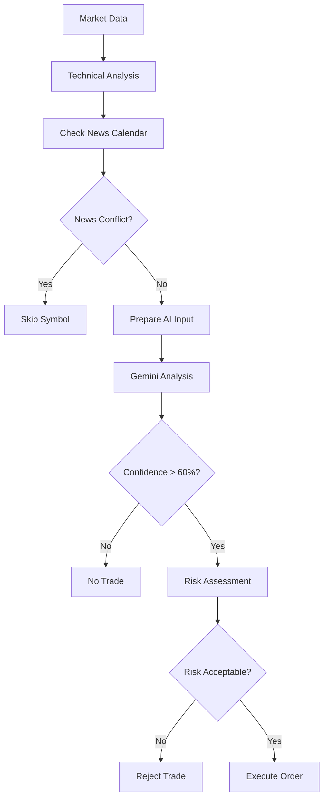

# MT5 Trading Bot with Gemini AI - Complete Documentation

## Table of Contents
1. [Project Overview](#project-overview)
2. [System Architecture](#system-architecture)
3. [Core Components](#core-components)
4. [Installation & Setup](#installation--setup)
5. [Configuration Details](#configuration-details)
6. [API Documentation](#api-documentation)
7. [Trading Logic](#trading-logic)
8. [Risk Management](#risk-management)
9. [News Integration](#news-integration)
10. [Telegram Notifications](#telegram-notifications)
11. [Development Guide](#development-guide)
12. [Deployment](#deployment)
13. [Testing](#testing)
14. [Troubleshooting](#troubleshooting)

---

## Project Overview

### Description
An advanced automated trading system for MetaTrader 5 that leverages Google's Gemini AI for market analysis and decision-making. The bot includes real-time news integration from ForexFactory, comprehensive risk management, and Telegram notifications.

### Key Features
- **AI-Powered Analysis**: Gemini AI analyzes market conditions and generates trading signals
- **Multi-Asset Support**: Forex, Commodities, Indices, Cryptocurrencies
- **News Integration**: ForexFactory calendar integration to avoid high-impact events
- **Risk Management**: Advanced position sizing, loss limits, correlation management
- **Real-time Alerts**: Telegram notifications for all trading activities
- **Session Optimization**: Trading based on market sessions
- **Automated Execution**: Direct integration with MT5 for order execution

### Technology Stack
```yaml
Language: Python 3.8+
AI Model: Google Gemini 1.5 Pro
Trading Platform: MetaTrader 5
Database: JSON/SQLite (optional)
Notifications: Telegram Bot API
News Source: ForexFactory
```

---

## System Architecture

### High-Level Architecture


### Component Interactions
```python
# Main execution flow
1. Market Data Collection (MT5) 
   ↓
2. News Check (ForexFactory)
   ↓
3. Technical Analysis (TA Library)
   ↓
4. AI Analysis (Gemini)
   ↓
5. Risk Assessment (Risk Manager)
   ↓
6. Order Execution (MT5)
   ↓
7. Notification (Telegram)
```

### Data Flow
```yaml
Input Sources:
  - MT5 Price Feeds: OHLCV data, tick data
  - ForexFactory: Economic calendar, news events
  - User Configuration: Risk parameters, symbols

Processing:
  - Technical Indicators: RSI, MACD, Bollinger Bands, etc.
  - AI Analysis: Pattern recognition, sentiment analysis
  - Risk Calculation: Position sizing, correlation check

Output:
  - Trading Signals: BUY/SELL/HOLD decisions
  - Orders: Market orders with SL/TP
  - Notifications: Telegram alerts
  - Logs: Detailed execution logs
```

---

## Core Components

### 1. MT5Connection Class
```python
class MT5Connection:
    """Manages connection to MetaTrader 5"""
    
    Methods:
        - connect(): Establish connection to MT5
        - disconnect(): Close MT5 connection
        - get_account_info(): Retrieve account details
        
    Properties:
        - login: MT5 account number
        - password: Account password
        - server: Broker server name
        - connected: Connection status
```

### 2. MarketDataMT5 Class
```python
class MarketDataMT5:
    """Handles market data retrieval and analysis"""
    
    Methods:
        - get_rates(): Fetch OHLCV data
        - calculate_indicators(): Compute technical indicators
        - get_market_analysis(): Complete market analysis
        - _determine_trend(): Identify market trend
        - _get_market_session(): Current trading session
        
    Indicators Calculated:
        - Moving Averages: SMA(20,50), EMA(12,26)
        - Oscillators: RSI(14), Stochastic(14,3,3)
        - Volatility: Bollinger Bands(20,2), ATR(14)
        - Trend: MACD(12,26,9)
        - Support/Resistance: Rolling min/max
```

### 3. GeminiTradingAI Class
```python
class GeminiTradingAI:
    """AI decision engine using Google Gemini"""
    
    Methods:
        - analyze_and_decide(): Generate trading decision
        - _validate_decision(): Validate AI output
        
    Decision Output Format:
        {
            "decision": "BUY/SELL/HOLD",
            "confidence": 60-100,
            "entry_price": float,
            "stop_loss": float,
            "take_profit_1": float,
            "take_profit_2": float,
            "take_profit_3": float,
            "position_size_percent": 1-5,
            "reasoning": "Detailed explanation",
            "key_levels": ["important prices"],
            "risk_factors": ["potential risks"],
            "time_horizon": "SHORT/MEDIUM/LONG"
        }
```

### 4. RiskManager Class
```python
class RiskManager:
    """Comprehensive risk management system"""
    
    Configuration:
        - max_risk_per_trade: 0.01 (1%)
        - max_daily_loss: 0.03 (3%)
        - max_weekly_loss: 0.05 (5%)
        - max_open_trades: 5
        - max_correlation_trades: 2
        
    Methods:
        - calculate_lot_size(): Position sizing
        - can_open_trade(): Pre-trade checks
        - check_daily_loss_limit(): Daily loss control
        - check_weekly_loss_limit(): Weekly loss control
        - check_correlation_limit(): Correlation management
        
    Position Sizing by Confidence:
        90%+ → 100% of risk allocation
        80-89% → 75% of risk allocation
        70-79% → 50% of risk allocation
        60-69% → 25% of risk allocation
```

### 5. ForexFactoryNews Class
```python
class ForexFactoryNews:
    """News calendar integration"""
    
    Methods:
        - fetch_calendar(): Scrape news events
        - get_upcoming_high_impact(): Filter important news
        - should_avoid_trading(): Check news conflicts
        - check_news_for_symbols(): Symbol-specific news
        - send_news_alert(): Telegram notifications
        
    News Impact Levels:
        - High (Red): NFP, Interest Rates, CPI
        - Medium (Orange): PMI, Retail Sales
        - Low (Yellow): Minor indicators
        
    Currency Mapping:
        USD → [EURUSD, GBPUSD, USDJPY, XAUUSD, ...]
        EUR → [EURUSD, EURGBP, EURJPY, ...]
        GBP → [GBPUSD, EURGBP, GBPJPY, ...]
```

### 6. TelegramNotifier Class
```python
class TelegramNotifier:
    """Telegram notification system"""
    
    Alert Types:
        - SIGNAL: New trading signal detected
        - OPENED: Position opened
        - CLOSED: Position closed
        - MODIFIED: SL/TP modified
        - ERROR: Execution error
        - SUMMARY: Account summary
        - RISK: Risk warnings
        - NEWS: Upcoming news events
        
    Methods:
        - send_message(): Generic message
        - send_trade_alert(): Trade-specific alerts
        - send_account_summary(): Daily summaries
        - send_risk_alert(): Risk warnings
        - send_news_alert(): News notifications
```

### 7. MT5TradingExecutor Class
```python
class MT5TradingExecutor:
    """Order execution and management"""
    
    Methods:
        - execute_trade(): Place new orders
        - manage_open_positions(): Position management
        - _trail_stop_loss(): Trailing stop implementation
        - _modify_position(): Modify SL/TP
        - close_position(): Close specific position
        - _close_all_positions(): Emergency close all
        
    Order Types:
        - Market orders with immediate execution
        - Stop Loss: Automatic loss limitation
        - Take Profit: Profit target levels
        - Trailing Stop: Dynamic SL adjustment
```

### 8. TradingBot Class
```python
class TradingBot:
    """Main controller orchestrating all components"""
    
    Methods:
        - start(): Initialize and start bot
        - run(): Main trading loop
        - stop(): Graceful shutdown
        - _check_spread(): Spread validation
        - _is_market_open(): Market hours check
        - _is_good_trading_session(): Session optimization
        - _check_risk_alerts(): Risk monitoring
        - _show_account_status(): Status display
        
    Execution Flow:
        1. Initialize components
        2. Connect to MT5
        3. Main loop:
           - Check market conditions
           - Check news events
           - Analyze markets
           - Generate signals
           - Execute trades
           - Manage positions
           - Send notifications
        4. Cleanup on shutdown
```

---

## Installation & Setup

### System Requirements
```yaml
Operating System: Windows 10/11 (MT5 requirement)
Python Version: 3.8 or higher
RAM: Minimum 4GB, Recommended 8GB
Storage: 2GB free space
Network: Stable internet connection
MT5: MetaTrader 5 terminal installed
```

### Step-by-Step Installation

#### 1. Environment Setup
```bash
# Clone or create project directory
mkdir mt5-trading-bot
cd mt5-trading-bot

# Create virtual environment
python -m venv venv

# Activate virtual environment
# Windows:
venv\Scripts\activate
# Linux/Mac (using Wine for MT5):
source venv/bin/activate
```

#### 2. Dependencies Installation
```bash
# Install required packages
pip install MetaTrader5==5.0.45
pip install pandas==2.1.4
pip install numpy==1.24.3
pip install ta==0.11.0
pip install google-generativeai==0.3.2
pip install python-telegram-bot==20.7
pip install beautifulsoup4==4.12.2
pip install lxml==4.9.4
pip install requests==2.31.0
pip install pytz==2023.3
pip install python-dotenv==1.0.0

# Optional: TA-Lib (requires C library)
# Download from https://www.lfd.uci.edu/~gohlke/pythonlibs/#ta-lib
pip install TA_Lib-0.4.28-cp38-cp38-win_amd64.whl
```

#### 3. Configuration Files
```bash
# Create .env file
touch .env

# Add configuration (edit with your values)
cat > .env << EOL
# MT5 Configuration
MT5_LOGIN=12345678
MT5_PASSWORD=your_password
MT5_SERVER=YourBroker-Demo

# API Keys
GEMINI_API_KEY=your_gemini_api_key
TELEGRAM_BOT_TOKEN=your_bot_token
TELEGRAM_CHAT_ID=your_chat_id

# Risk Settings
MAX_RISK_PER_TRADE=0.01
MAX_DAILY_LOSS=0.03
MAX_WEEKLY_LOSS=0.05
EOL
```

#### 4. MT5 Terminal Setup
```yaml
Steps:
  1. Open MT5 Terminal
  2. Login to your account (demo or real)
  3. Tools → Options → Expert Advisors:
     - Allow automated trading ✓
     - Allow DLL imports ✓
     - Disable manual confirmation ✓
  4. Ensure symbols are visible in Market Watch
  5. Keep terminal running while bot operates
```

#### 5. API Keys Setup

##### Gemini API
```yaml
1. Visit: https://makersuite.google.com/app/apikey
2. Click: "Create API Key"
3. Copy the key
4. Add to .env file: GEMINI_API_KEY=your_key_here
```

##### Telegram Bot
```yaml
1. Open Telegram → Search "@BotFather"
2. Send: /newbot
3. Choose name: "MT5 Trading Bot"
4. Choose username: "mt5_trading_bot"
5. Copy token → Add to .env: TELEGRAM_BOT_TOKEN=token

Getting Chat ID:
1. Add bot to your chat/group
2. Send any message to bot
3. Visit: https://api.telegram.org/bot{TOKEN}/getUpdates
4. Find "chat":{"id": number}
5. Add to .env: TELEGRAM_CHAT_ID=number
```

---

## Configuration Details

### Main Configuration Structure
```python
custom_config = {
    # Symbol Configuration
    'symbols': {
        'EURUSD': {
            'enabled': True,
            'max_spread': 20,
            'min_volume': 0.01,
            'max_volume': 1.0,
            'trade_sessions': ['EUROPEAN', 'US']
        },
        'XAUUSD': {
            'enabled': True,
            'max_spread': 50,
            'min_volume': 0.01,
            'max_volume': 0.5,
            'trade_sessions': ['EUROPEAN', 'US']
        }
    },
    
    # Risk Management
    'risk_config': {
        'max_risk_per_trade': 0.01,  # 1% per trade
        'max_daily_loss': 0.03,       # 3% daily limit
        'max_weekly_loss': 0.05,      # 5% weekly limit
        'max_open_trades': 5,         # Maximum concurrent positions
        'max_correlation_trades': 2,   # Max correlated positions
        'risk_free_profit_lock': 0.5, # Move SL to BE at 50% of TP
        'trailing_stop_activation': 1.5, # Activate at 1.5 R:R
        'position_size_by_confidence': {
            90: 1.0,   # Full position size
            80: 0.75,  # 75% position size
            70: 0.5,   # 50% position size
            60: 0.25   # 25% position size
        }
    },
    
    # Trading Parameters
    'trading_params': {
        'check_interval': 300,         # Check every 5 minutes
        'min_confidence': 60,          # Minimum AI confidence
        'use_news_filter': True,       # Enable news filtering
        'news_avoidance_minutes_before': 30,
        'news_avoidance_minutes_after': 30,
        'max_spread_multiplier': 2.0,  # Max spread tolerance
    },
    
    # Session Configuration (Bangkok Time GMT+7)
    'trading_sessions': {
        'ASIAN': {
            'start': 7,
            'end': 16,
            'volatility_factor': 0.7,
            'preferred_pairs': ['USDJPY', 'AUDUSD', 'NZDUSD']
        },
        'EUROPEAN': {
            'start': 14,
            'end': 23,
            'volatility_factor': 1.0,
            'preferred_pairs': ['EURUSD', 'GBPUSD', 'EURGBP']
        },
        'US': {
            'start': 20,
            'end': 5,
            'volatility_factor': 1.2,
            'preferred_pairs': ['EURUSD', 'GBPUSD', 'USDJPY']
        },
        'enabled': True
    },
    
    # Notification Settings
    'notifications': {
        'telegram_enabled': True,
        'signal_alerts': True,
        'trade_alerts': True,
        'risk_alerts': True,
        'news_alerts': True,
        'summary_times': [9, 15, 21],  # Hours for daily summary
        'min_profit_alert': 50,        # Alert if profit > $50
        'min_loss_alert': 30          # Alert if loss > $30
    }
}
```

### Symbol-Specific Settings
```python
symbol_configs = {
    # Forex Majors
    'EURUSD': {
        'pip_value': 0.0001,
        'min_stop_pips': 10,
        'max_stop_pips': 50,
        'default_tp_ratio': 2.0,
        'news_sensitivity': 'HIGH'
    },
    
    # Gold
    'XAUUSD': {
        'pip_value': 0.01,
        'min_stop_pips': 30,
        'max_stop_pips': 100,
        'default_tp_ratio': 1.5,
        'news_sensitivity': 'MEDIUM',
        'volatility_adjustment': 0.7  # Reduce position size
    },
    
    # Indices
    'US30': {
        'pip_value': 1.0,
        'min_stop_pips': 50,
        'max_stop_pips': 200,
        'default_tp_ratio': 2.0,
        'news_sensitivity': 'HIGH',
        'trade_only_session': 'US'
    }
}
```

---

## API Documentation

### Public Methods

#### TradingBot
```python
bot = TradingBot(mt5_login, mt5_password, mt5_server, 
                 gemini_api_key, telegram_token, 
                 telegram_chat_id, config)

bot.start()  # Initialize and start trading
bot.stop()   # Graceful shutdown
```

#### Market Analysis
```python
# Get market data
market_data = MarketDataMT5()
df = market_data.get_rates('EURUSD', mt5.TIMEFRAME_H1, 100)
df = market_data.calculate_indicators(df)
analysis = market_data.get_market_analysis('EURUSD')
```

#### AI Analysis
```python
# Get AI decision
gemini = GeminiTradingAI(api_key)
decision = gemini.analyze_and_decide(market_analysis)
# Returns: {decision, confidence, entry_price, stop_loss, ...}
```

#### Risk Management
```python
# Calculate position size
risk_manager = RiskManager(initial_balance=10000)
lot_size = risk_manager.calculate_lot_size(
    symbol='EURUSD',
    entry=1.0850,
    stop_loss=1.0820,
    confidence=85,
    account_balance=10000
)

# Check if can trade
can_trade, reason = risk_manager.can_open_trade('EURUSD')
```

#### News Checking
```python
# Check for news
news = ForexFactoryNews()
avoid, reason = news.should_avoid_trading('EURUSD', 
                                         minutes_before=30,
                                         minutes_after=30)

# Get upcoming high impact
upcoming = news.get_upcoming_high_impact(hours_ahead=2)

# Check affected symbols
affected = news.check_news_for_symbols(['EURUSD', 'GBPUSD'])
```

#### Order Execution
```python
# Execute trade
executor = MT5TradingExecutor(risk_manager, telegram)
success = executor.execute_trade(signal, 'EURUSD')

# Manage positions
executor.manage_open_positions(gemini_ai, market_data)

# Close position
executor.close_position(position)
```

### Webhook Integration (Future)
```python
# Flask API endpoint example
@app.route('/webhook/signal', methods=['POST'])
def receive_signal():
    data = request.json
    signal = {
        'symbol': data['symbol'],
        'decision': data['action'],
        'confidence': data['confidence']
    }
    bot.process_external_signal(signal)
    return jsonify({'status': 'processed'})
```

---

## Trading Logic

### Signal Generation Flow


### Entry Criteria
```python
Entry Conditions (ALL must be true):
1. AI Confidence ≥ 60%
2. Risk/Reward Ratio ≥ 1:1.5
3. Spread < Max Allowed
4. No high-impact news ±30 minutes
5. Daily loss limit not reached
6. Correlation limit not exceeded
7. Market session appropriate
8. Technical confluence present
```

### Exit Strategies
```python
Exit Types:
1. Take Profit Levels:
   - TP1: 1.5x risk (50% position)
   - TP2: 2.0x risk (30% position)
   - TP3: 3.0x risk (20% position)

2. Stop Loss:
   - Initial: Based on ATR or support/resistance
   - Break-even: When 50% of TP1 reached
   - Trailing: Activated at 1.5 R:R

3. Time-based:
   - Close before high-impact news
   - End of trading session
   - Weekend closure

4. Risk-based:
   - Daily loss limit reached
   - Correlation threshold exceeded
```

### Position Management
```python
Position Lifecycle:
1. Signal Generation
   ↓
2. Risk Validation
   ↓
3. Position Sizing
   ↓
4. Order Execution
   ↓
5. Initial SL/TP Setting
   ↓
6. Monitoring Phase:
   - Break-even adjustment
   - Trailing stop activation
   - Partial profit taking
   ↓
7. Position Closure
   ↓
8. Performance Logging
```

---

## Risk Management

### Position Sizing Formula
```python
def calculate_position_size(account_balance, risk_percent, 
                           stop_loss_pips, pip_value):
    """
    Kelly Criterion Modified for Forex
    """
    # Base risk amount
    risk_amount = account_balance * risk_percent
    
    # Confidence adjustment
    confidence_factor = get_confidence_multiplier(confidence)
    adjusted_risk = risk_amount * confidence_factor
    
    # Asset class adjustment
    asset_multiplier = get_asset_multiplier(symbol)
    final_risk = adjusted_risk * asset_multiplier
    
    # Calculate lots
    position_value = final_risk / (stop_loss_pips * pip_value)
    
    # Apply maximum limits
    return min(position_value, max_position_limit)
```

### Risk Parameters by Asset Class
```python
ASSET_RISK_MULTIPLIERS = {
    'Major_Forex': 1.0,      # Full risk
    'Cross_Pairs': 0.9,      # 90% of risk
    'Gold': 0.7,             # 70% of risk
    'Silver': 0.8,           # 80% of risk
    'Oil': 0.6,              # 60% of risk
    'Indices': 0.8,          # 80% of risk
    'Crypto': 0.5            # 50% of risk
}
```

### Correlation Management
```python
CORRELATION_GROUPS = {
    'USD_Majors': ['EURUSD', 'GBPUSD', 'USDJPY', 'USDCHF'],
    'EUR_Crosses': ['EURUSD', 'EURGBP', 'EURJPY', 'EURCHF'],
    'Commodity_Bloc': ['AUDUSD', 'NZDUSD', 'USDCAD'],
    'Safe_Haven': ['USDJPY', 'USDCHF', 'XAUUSD'],
    'Risk_Assets': ['AUDUSD', 'NZDUSD', 'US500', 'BTCUSD']
}

# Maximum 2 positions in same correlation group
MAX_CORRELATED_POSITIONS = 2
```

### Daily Loss Recovery Protocol
```python
if daily_loss >= max_daily_loss * 0.5:  # 50% of limit
    # Reduce position sizes by 50%
    position_multiplier = 0.5
    
if daily_loss >= max_daily_loss * 0.8:  # 80% of limit
    # Only take A+ setups (confidence > 85%)
    min_confidence = 85
    
if daily_loss >= max_daily_loss:  # 100% limit reached
    # Stop trading for the day
    trading_enabled = False
```

---

## News Integration

### ForexFactory Calendar Structure
```python
NEWS_EVENT = {
    'datetime': datetime,      # Event time (Bangkok TZ)
    'currency': 'USD',        # Affected currency
    'impact': 'high',         # high/medium/low
    'event': 'Non-Farm Payrolls',
    'forecast': '185K',
    'previous': '227K',
    'actual': ''              # Filled after release
}
```

### News Filtering Logic
```python
def should_avoid_trading(symbol, event):
    # Check if symbol is affected
    affected_currencies = get_affected_currencies(symbol)
    if event['currency'] not in affected_currencies:
        return False
    
    # Check time window
    time_until_event = (event['datetime'] - now).minutes
    
    if event['impact'] == 'high':
        avoid_window = (-30, +30)  # ±30 minutes
    elif event['impact'] == 'medium':
        avoid_window = (-15, +15)  # ±15 minutes
    else:
        return False  # Don't avoid low impact
    
    return avoid_window[0] <= time_until_event <= avoid_window[1]
```

### High Impact Events List
```python
HIGH_IMPACT_EVENTS = [
    # US Events
    'Non-Farm Payrolls',
    'FOMC Meeting Minutes',
    'Federal Funds Rate',
    'CPI m/m',
    'Core PCE Price Index',
    'GDP q/q',
    
    # European Events
    'ECB Interest Rate Decision',
    'ECB Press Conference',
    'German CPI',
    'EU GDP',
    
    # UK Events
    'BOE Interest Rate Decision',
    'UK GDP',
    'UK CPI',
    
    # Other
    'BOJ Policy Rate',
    'RBA Rate Statement',
    'RBNZ Interest Rate Decision'
]
```

---

## Telegram Notifications

### Message Templates
```python
# Trade Opened
TRADE_OPENED_TEMPLATE = """
🟢 TRADE OPENED 🟢
━━━━━━━━━━━━━━━━
📊 Symbol: {symbol}
📍 Type: {order_type}
📦 Volume: {volume} lots
💰 Entry: {entry_price}
🛑 SL: {stop_loss} ({risk_pips} pips)
🎯 TP: {take_profit} ({reward_pips} pips)
📊 R:R Ratio: 1:{rr_ratio}
💯 Confidence: {confidence}%
🎫 Ticket: #{ticket}
⏰ {timestamp}
"""

# Risk Alert
RISK_ALERT_TEMPLATE = """
⚠️ RISK ALERT ⚠️
━━━━━━━━━━━━━━━━
📉 Type: {alert_type}
💰 Balance: ${balance}
📊 Drawdown: {drawdown}%
🛑 Action: {action}
💡 Suggestion: {suggestion}
⏰ {timestamp}
"""

# News Alert
NEWS_ALERT_TEMPLATE = """
📰 HIGH IMPACT NEWS 📰
━━━━━━━━━━━━━━━━
🔴 {currency} - {event}
⏰ Time: {time} ({minutes_until})
📊 Forecast: {forecast}
📈 Previous: {previous}
⚠️ Affected: {symbols}
💡 Avoid trading ±30 min
"""
```

### Alert Priority Levels
```python
ALERT_PRIORITIES = {
    'CRITICAL': [
        'Daily loss limit reached',
        'System error',
        'Connection lost'
    ],
    'HIGH': [
        'Trade opened/closed',
        'High impact news',
        'Risk warning'
    ],
    'MEDIUM': [
        'Position modified',
        'Signal detected',
        'Session change'
    ],
    'LOW': [
        'Account summary',
        'Performance report'
    ]
}
```

---

## Development Guide

### Project Structure
```
mt5-trading-bot/
├── src/
│   ├── __init__.py
│   ├── trading_bot.py          # Main bot controller
│   ├── connections/
│   │   ├── mt5_connection.py   # MT5 interface
│   │   └── telegram_bot.py     # Telegram interface
│   ├── analysis/
│   │   ├── market_data.py      # Market data handler
│   │   ├── technical.py        # Technical indicators
│   │   └── gemini_ai.py        # AI analysis
│   ├── trading/
│   │   ├── executor.py         # Order execution
│   │   ├── risk_manager.py     # Risk management
│   │   └── position_manager.py # Position tracking
│   ├── utils/
│   │   ├── news_checker.py     # News integration
│   │   ├── logger.py           # Logging utilities
│   │   └── helpers.py          # Helper functions
│   └── config/
│       ├── settings.py         # Configuration loader
│       └── constants.py        # Constants
├── tests/
│   ├── test_connection.py
│   ├── test_analysis.py
│   ├── test_risk.py
│   └── test_execution.py
├── data/
│   ├── logs/
│   ├── trades/
│   └── backtest/
├── configs/
│   ├── symbols.json
│   ├── strategies.json
│   └── risk_profiles.json
├── docs/
│   ├── API.md
│   ├── SETUP.md
│   └── TRADING.md
├── requirements.txt
├── .env.example
├── .gitignore
├── README.md
└── setup.py
```

### Code Style Guidelines
```python
# Naming Conventions
class_name = PascalCase
function_name = snake_case
CONSTANT_NAME = UPPER_SNAKE_CASE
variable_name = snake_case

# Docstring Format
def function_name(param1: type, param2: type) -> return_type:
    """
    Brief description of function.
    
    Args:
        param1: Description of param1
        param2: Description of param2
        
    Returns:
        Description of return value
        
    Raises:
        ExceptionType: Description of when raised
    """
    pass

# Type Hints
from typing import Dict, List, Optional, Tuple, Union

def analyze_market(
    symbol: str,
    timeframe: int,
    indicators: Optional[List[str]] = None
) -> Dict[str, Union[float, str]]:
    pass
```

### Adding New Features
```python
# 1. Create feature branch
git checkout -b feature/new-indicator

# 2. Implement feature
class NewIndicator:
    """Implementation of new technical indicator"""
    pass

# 3. Add tests
def test_new_indicator():
    """Test cases for new indicator"""
    pass

# 4. Update documentation
# Add to README.md and relevant docs

# 5. Submit PR with:
# - Feature description
# - Test results
# - Performance impact
# - Configuration changes
```

### Error Handling Pattern
```python
class TradingError(Exception):
    """Base exception for trading errors"""
    pass

class ConnectionError(TradingError):
    """MT5 connection errors"""
    pass

class ExecutionError(TradingError):
    """Order execution errors"""
    pass

# Usage
try:
    result = mt5.order_send(request)
    if result.retcode != mt5.TRADE_RETCODE_DONE:
        raise ExecutionError(f"Order failed: {result.comment}")
except ExecutionError as e:
    logger.error(f"Execution error: {e}")
    if telegram:
        telegram.send_alert(f"⚠️ Order failed: {e}")
    return False
```

---

## Testing

### Unit Tests
```python
# test_risk_manager.py
import pytest
from src.trading.risk_manager import RiskManager

class TestRiskManager:
    def setup_method(self):
        self.risk_manager = RiskManager(initial_balance=10000)
    
    def test_position_sizing(self):
        """Test position size calculation"""
        lot_size = self.risk_manager.calculate_lot_size(
            symbol='EURUSD',
            entry=1.1000,
            stop_loss=1.0950,
            confidence=80,
            account_balance=10000
        )
        assert 0 < lot_size <= 1.0
    
    def test_daily_loss_limit(self):
        """Test daily loss limit enforcement"""
        # Simulate losses
        self.risk_manager.daily_pnl = -250  # 2.5% loss
        can_trade, reason = self.risk_manager.can_open_trade()
        assert can_trade == True
        
        self.risk_manager.daily_pnl = -350  # 3.5% loss
        can_trade, reason = self.risk_manager.can_open_trade()
        assert can_trade == False
        assert "Daily loss limit" in reason
```

### Integration Tests
```python
# test_integration.py
import asyncio
from src.trading_bot import TradingBot

async def test_full_cycle():
    """Test complete trading cycle"""
    bot = TradingBot(
        mt5_login=TEST_LOGIN,
        mt5_password=TEST_PASSWORD,
        mt5_server=TEST_SERVER,
        gemini_api_key=TEST_API_KEY,
        config=TEST_CONFIG
    )
    
    # Start bot
    assert bot.start() == True
    
    # Run one cycle
    await bot.run_cycle()
    
    # Check results
    assert bot.executor.trades_executed >= 0
    
    # Stop bot
    bot.stop()
```

### Backtesting Framework
```python
# backtest.py
class Backtester:
    def __init__(self, strategy, data, initial_balance=10000):
        self.strategy = strategy
        self.data = data
        self.balance = initial_balance
        self.trades = []
        
    def run(self, start_date, end_date):
        """Run backtest over historical data"""
        for timestamp, candle in self.data.iterrows():
            # Generate signal
            signal = self.strategy.analyze(candle)
            
            # Execute trade
            if signal['decision'] != 'HOLD':
                trade = self.execute_trade(signal, candle)
                self.trades.append(trade)
            
            # Update positions
            self.update_positions(candle)
        
        return self.calculate_statistics()
    
    def calculate_statistics(self):
        """Calculate performance metrics"""
        return {
            'total_trades': len(self.trades),
            'win_rate': self.calculate_win_rate(),
            'profit_factor': self.calculate_profit_factor(),
            'sharpe_ratio': self.calculate_sharpe_ratio(),
            'max_drawdown': self.calculate_max_drawdown(),
            'total_return': (self.balance - 10000) / 10000
        }
```

### Performance Testing
```python
# test_performance.py
import time
import cProfile
import pstats

def test_analysis_performance():
    """Test market analysis performance"""
    profiler = cProfile.Profile()
    profiler.enable()
    
    start = time.time()
    
    # Run analysis 100 times
    for _ in range(100):
        market_data = get_market_data('EURUSD')
        analysis = calculate_indicators(market_data)
        decision = gemini_ai.analyze(analysis)
    
    elapsed = time.time() - start
    
    profiler.disable()
    stats = pstats.Stats(profiler)
    stats.sort_stats('cumulative')
    stats.print_stats(10)
    
    assert elapsed < 30  # Should complete in 30 seconds
    print(f"Analysis completed in {elapsed:.2f} seconds")
```

---

## Deployment

### Local Deployment
```bash
# 1. Setup environment
python -m venv venv
venv\Scripts\activate

# 2. Install dependencies
pip install -r requirements.txt

# 3. Configure settings
copy .env.example .env
# Edit .env with your credentials

# 4. Run bot
python src/trading_bot.py

# 5. Monitor logs
tail -f data/logs/trading_bot.log
```

### Windows Service Deployment
```bash
# Using NSSM (Non-Sucking Service Manager)
1. Download NSSM from https://nssm.cc/
2. Install service:
   nssm install MT5TradingBot
3. Configure:
   Path: C:\Python38\python.exe
   Startup directory: C:\mt5-trading-bot
   Arguments: src\trading_bot.py
4. Start service:
   nssm start MT5TradingBot
```

### Docker Deployment
```dockerfile
# Dockerfile
FROM python:3.8-windowsservercore

WORKDIR /app

# Install dependencies
COPY requirements.txt .
RUN pip install --no-cache-dir -r requirements.txt

# Copy application
COPY . .

# Set environment variables
ENV PYTHONUNBUFFERED=1

# Run bot
CMD ["python", "src/trading_bot.py"]
```

```yaml
# docker-compose.yml
version: '3.8'

services:
  trading-bot:
    build: .
    container_name: mt5-trading-bot
    environment:
      - MT5_LOGIN=${MT5_LOGIN}
      - MT5_PASSWORD=${MT5_PASSWORD}
      - MT5_SERVER=${MT5_SERVER}
      - GEMINI_API_KEY=${GEMINI_API_KEY}
      - TELEGRAM_BOT_TOKEN=${TELEGRAM_BOT_TOKEN}
      - TELEGRAM_CHAT_ID=${TELEGRAM_CHAT_ID}
    volumes:
      - ./data:/app/data
      - ./configs:/app/configs
    restart: unless-stopped
```

### Cloud Deployment (VPS)
```bash
# 1. Setup Windows VPS (AWS EC2, Azure, etc.)
# 2. Install prerequisites
# - Python 3.8+
# - MT5 Terminal
# - Git

# 3. Clone repository
git clone https://github.com/yourusername/mt5-trading-bot.git

# 4. Setup as Windows Service
sc create MT5Bot binPath= "C:\Python\python.exe C:\mt5-bot\src\trading_bot.py"
sc start MT5Bot

# 5. Setup monitoring
# - CloudWatch (AWS)
# - Azure Monitor
# - Custom dashboard
```

### Production Checklist
```yaml
Pre-deployment:
  ✓ Test on demo account for 1+ month
  ✓ Verify all API keys
  ✓ Configure risk parameters conservatively
  ✓ Setup error notifications
  ✓ Create backup configuration
  ✓ Document emergency procedures

Deployment:
  ✓ Use production MT5 credentials
  ✓ Enable logging
  ✓ Setup monitoring alerts
  ✓ Configure auto-restart
  ✓ Test emergency shutdown

Post-deployment:
  ✓ Monitor first 24 hours closely
  ✓ Daily performance review
  ✓ Weekly risk assessment
  ✓ Monthly strategy evaluation
  ✓ Regular code updates
```

---

## Troubleshooting

### Common Issues and Solutions

#### MT5 Connection Issues
```python
# Problem: Cannot connect to MT5
# Solutions:
1. Check MT5 Terminal is running
2. Verify login credentials
3. Ensure correct server name
4. Check firewall settings
5. Enable automated trading in MT5

# Debug code:
if not mt5.initialize():
    print(f"MT5 Error: {mt5.last_error()}")
    # Error codes:
    # (-2, 'Terminal: Invalid params')
    # (-10003, 'Terminal: Not found')
    # (-10004, 'Terminal: Connection failed')
```

#### Gemini API Issues
```python
# Problem: Gemini API errors
# Solutions:
1. Verify API key is valid
2. Check rate limits (60 requests/minute)
3. Ensure prompt format is correct
4. Handle API exceptions

# Debug code:
try:
    response = gemini.generate_content(prompt)
except Exception as e:
    print(f"Gemini Error: {e}")
    # Common errors:
    # 'Invalid API key'
    # 'Rate limit exceeded'
    # 'Model overloaded'
```

#### Telegram Issues
```python
# Problem: Telegram messages not sending
# Solutions:
1. Verify bot token
2. Check chat ID (use negative for groups)
3. Ensure bot has message permissions
4. Test connection manually

# Test command:
curl -X POST "https://api.telegram.org/bot<TOKEN>/sendMessage" \
     -d "chat_id=<CHAT_ID>" \
     -d "text=Test message"
```

#### Trading Issues
```python
# Problem: Orders not executing
# Errors and solutions:

TRADE_RETCODE_INVALID_PRICE (10015):
- Update to current market price
- Increase deviation parameter

TRADE_RETCODE_NO_MONEY (10019):
- Insufficient margin
- Reduce position size

TRADE_RETCODE_MARKET_CLOSED (10018):
- Check market hours
- Verify symbol trading sessions

TRADE_RETCODE_INVALID_STOPS (10016):
- Check minimum stop distance
- Verify stop loss/take profit levels
```

### Performance Optimization
```python
# 1. Reduce API calls
cache_duration = 300  # 5 minutes
if time.time() - last_fetch > cache_duration:
    data = fetch_new_data()

# 2. Optimize indicators calculation
# Use vectorized operations with pandas
df['sma'] = df['close'].rolling(20).mean()  # Fast
# Instead of loops
for i in range(20, len(df)):  # Slow
    sma = sum(df['close'][i-20:i]) / 20

# 3. Async operations
async def analyze_multiple_symbols(symbols):
    tasks = [analyze_symbol(s) for s in symbols]
    results = await asyncio.gather(*tasks)
    return results

# 4. Database for history
# Use SQLite instead of JSON for trade history
import sqlite3
conn = sqlite3.connect('trades.db')
```

### Emergency Procedures
```python
# 1. Emergency stop button
def emergency_stop():
    """Immediately stop all trading"""
    logger.critical("EMERGENCY STOP ACTIVATED")
    
    # Close all positions
    positions = mt5.positions_get()
    for pos in positions:
        close_position_immediately(pos)
    
    # Stop bot
    bot.running = False
    
    # Send alert
    telegram.send_alert("🚨 EMERGENCY STOP - All positions closed")

# 2. Maximum loss circuit breaker
if account_drawdown > 0.10:  # 10% drawdown
    emergency_stop()
    send_admin_alert("Circuit breaker triggered: 10% drawdown")

# 3. Connection monitor
def monitor_connections():
    if not mt5.terminal_info():
        reconnect_mt5()
    
    if not check_internet():
        pause_trading()
    
    if not gemini.is_available():
        use_backup_strategy()
```

---

## Appendix

### Glossary
```yaml
ATR: Average True Range - Volatility indicator
BE: Break Even - Moving stop loss to entry price
DD: Drawdown - Peak to trough decline
EA: Expert Advisor - Automated trading system
HFT: High Frequency Trading
LOT: Standard unit of trading (usually 100,000 units)
MAE: Maximum Adverse Excursion
MFE: Maximum Favorable Excursion
PIP: Smallest price move in forex
R:R: Risk to Reward ratio
SL: Stop Loss
TP: Take Profit
```

### Useful Resources
```yaml
Documentation:
  - MT5 Python: https://www.mql5.com/en/docs/python_metatrader5
  - Gemini AI: https://ai.google.dev/docs
  - Telegram Bot: https://core.telegram.org/bots/api
  - TA-Lib: https://mrjbq7.github.io/ta-lib/

Communities:
  - MQL5 Forum: https://www.mql5.com/en/forum
  - Reddit: r/algotrading, r/forex
  - Discord: Algorithmic Trading servers

Data Sources:
  - ForexFactory: https://www.forexfactory.com
  - Investing.com: https://www.investing.com
  - TradingView: https://www.tradingview.com

Brokers with MT5 API:
  - IC Markets
  - Pepperstone
  - Admiral Markets
  - XM
  - FBS
```

### License
```
MIT License

Copyright (c) 2024 MT5 Trading Bot

Permission is hereby granted, free of charge, to any person obtaining a copy
of this software and associated documentation files (the "Software"), to deal
in the Software without restriction, including without limitation the rights
to use, copy, modify, merge, publish, distribute, sublicense, and/or sell
copies of the Software, and to permit persons to whom the Software is
furnished to do so, subject to the following conditions:

The above copyright notice and this permission notice shall be included in all
copies or substantial portions of the Software.

THE SOFTWARE IS PROVIDED "AS IS", WITHOUT WARRANTY OF ANY KIND, EXPRESS OR
IMPLIED, INCLUDING BUT NOT LIMITED TO THE WARRANTIES OF MERCHANTABILITY,
FITNESS FOR A PARTICULAR PURPOSE AND NONINFRINGEMENT.
```

---

## Version History

### v1.0.0 (Current)
- Initial release with core functionality
- MT5 integration
- Gemini AI analysis
- Telegram notifications
- ForexFactory news integration
- Basic risk management

### Roadmap v2.0.0
- [ ] Web dashboard with real-time charts
- [ ] Machine learning model training
- [ ] Multi-strategy support
- [ ] Advanced order types (OCO, Bracket)
- [ ] Sentiment analysis integration
- [ ] Cloud deployment support
- [ ] Mobile app for monitoring
- [ ] Backtesting engine improvements
- [ ] API for external signals
- [ ] Portfolio optimization

---

*This documentation is comprehensive and designed for Claude Code or any AI assistant to understand and continue development of the MT5 Trading Bot system.*